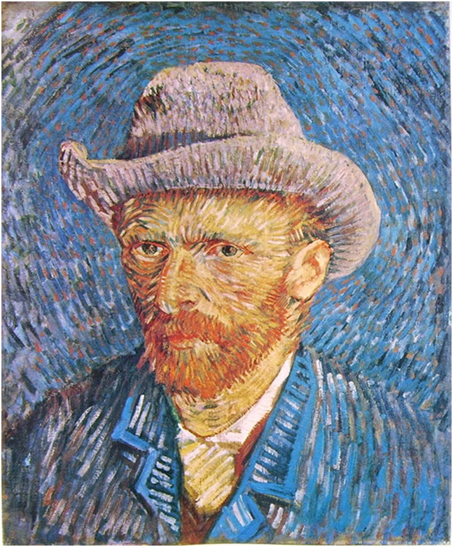

# neural-style-transfer
[Neural Style Transfer](https://arxiv.org/abs/1508.06576) implementation in Tensorflow 2.0

---
| Content | Generated | Style |
| - | - | - |
|  |  |  |
|  |  |  |
---

## Example usage
```python
# See example.py file
from src.nst import generate_image

generate_image(
    content_path="./images/contents/ed.jpg",
    style_path="./images/styles/self.jpg",
    out_path="./images/results/out.jpg", # remember to put the file extension
    size=(600, 400),  # the size of the output image
    content_layer="block5_conv2",
    content_weight=1e3,
    style_layers=['block1_conv1', 'block2_conv1', 'block3_conv1', 'block4_conv1', 'block5_conv1'],
    style_weight=1e-3,
    learning_rate=1.0,
    num_iterations=1000,
    save_every=50  # save image to out_path every 50 iterations
)
```